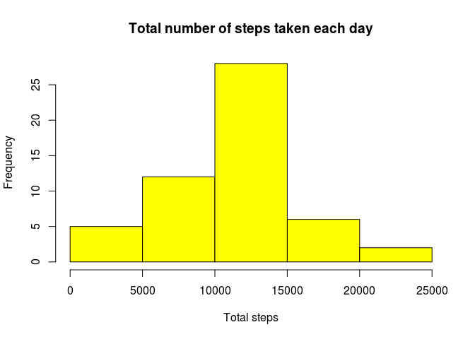
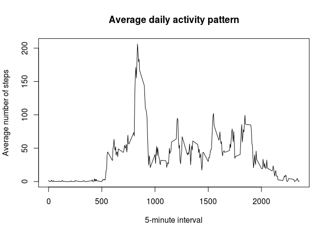
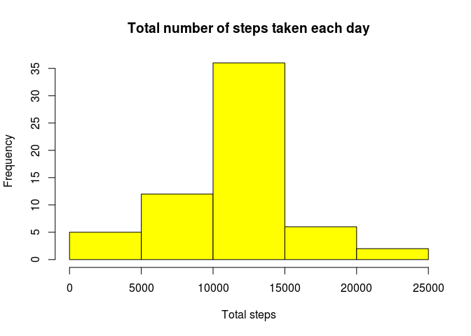
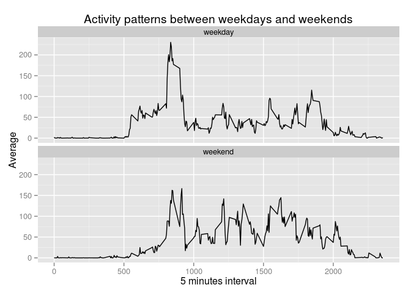

# Reproducible Research: Peer Assessment 1


## Loading and preprocessing the data
Starting from the dataset provided for the project work, the following code extract 
data from the zip archive and prepare a variable with the complete cases:

```r
unzippedData <- unzip("activity.zip")
data <- read.csv(unzippedData, stringsAsFactors = FALSE)
data$date <- as.Date(data$date)
dataClean <- data[complete.cases(data),]
```


## What is mean total number of steps taken per day?
I calculate the total number of steps taken per day using the summarize function of the dplyr package.

```r
library("dplyr")
byDate <- group_by(dataClean, date)
stepsPerDay <- summarize(byDate, stepsPerDay = sum(steps))
```

The following histogram describes the total number of steps taken per day:

```r
hist(stepsPerDay$stepsPerDay, main = "Total number of steps taken each day",
     xlab = "Total steps", col = 'yellow')
```

 

The mean of the total number of steps is 1.0766189\times 10^{4} calculated 
with the following code:

```r
mean(stepsPerDay$stepsPerDay)
```

```
## [1] 10766.19
```

The median of the total number of steps is 10765 calculated 
with the following code:

```r
median(stepsPerDay$stepsPerDay)
```

```
## [1] 10765
```


## What is the average daily activity pattern?
The following plot describes the distribution of daily average steps calculated 
for each 5 minutes interval:

```r
intervals <- unique(dataClean$interval)

fiveMinutes <- data.frame()

for(i in intervals) {
    intervalSubset <- filter(dataClean, interval == i)
    
    fiveMinutes <- rbind(fiveMinutes, c(interval = i, average = mean(intervalSubset$steps)))
}

plot(fiveMinutes[, 1], fiveMinutes[, 2], type="l", xlab = "5-minute interval", 
     ylab = "Average number of steps", main = "Average daily activity pattern")
```

 

```r
stepsMax = fiveMinutes[which(fiveMinutes[, 2] == max(fiveMinutes[, 2])), 1]
```

The maximum average number of steps is in the interval 835.


## Imputing missing values

```r
totNA <- sum(is.na(data$steps))
```
The total number of missing values in the dataset is 2304.

I replace the NA with the mean of the respective 5-minute interval.

```r
NAreplacement <- data

for(i in 1:nrow(data)) {
    if(is.na(data[i, 1])) {        
        intervalAverage <- fiveMinutes[which(fiveMinutes[, 1] == data[i, 3]), 2]        
        NAreplacement[i, 1] <- intervalAverage
    }
}
```

The following histogram describes the total number of steps taken per day:

```r
byDate <- group_by(NAreplacement, date)
stepsPerDay <- summarize(byDate, stepsPerDay = sum(steps))

hist(stepsPerDay$stepsPerDay, main = "Total number of steps taken each day",
     xlab = "Total steps", col = 'yellow')
```

 

The mean of the total number of steps is 1.0766189\times 10^{4} calculated 
with the following code:

```r
mean(stepsPerDay$stepsPerDay)
```

```
## [1] 10766.19
```

The median of the total number of steps is 1.0766189\times 10^{4} calculated with the following code:

```r
median(stepsPerDay$stepsPerDay)
```

```
## [1] 10766.19
```

## Are there differences in activity patterns between weekdays and weekends?
The following code create a new factor variable in which a given date is labeled as a weekday or weekend day.

```r
NAreplacement$dayType <- weekdays(NAreplacement$date)
NAreplacement$dayType[NAreplacement$dayType == 'sabato' | NAreplacement$dayType == 'domenica'] <- 'weekend'
NAreplacement$dayType[NAreplacement$dayType != 'weekend'] <- 'weekday'
NAreplacement$dayType <- as.factor(NAreplacement$dayType)
```


```r
library(ggplot2)

averageStepsDayType <- aggregate(
    NAreplacement$steps, 
    by=list(interval=NAreplacement$interval, dayType=NAreplacement$dayType), 
    mean)

ggplot(averageStepsDayType, aes(interval, x)) + geom_line() + facet_wrap(~ dayType, ncol = 1, nrow = 2) + xlab("5 minutes interval") + ylab("Average") + ggtitle("Activity patterns between weekdays and weekends")
```

 
